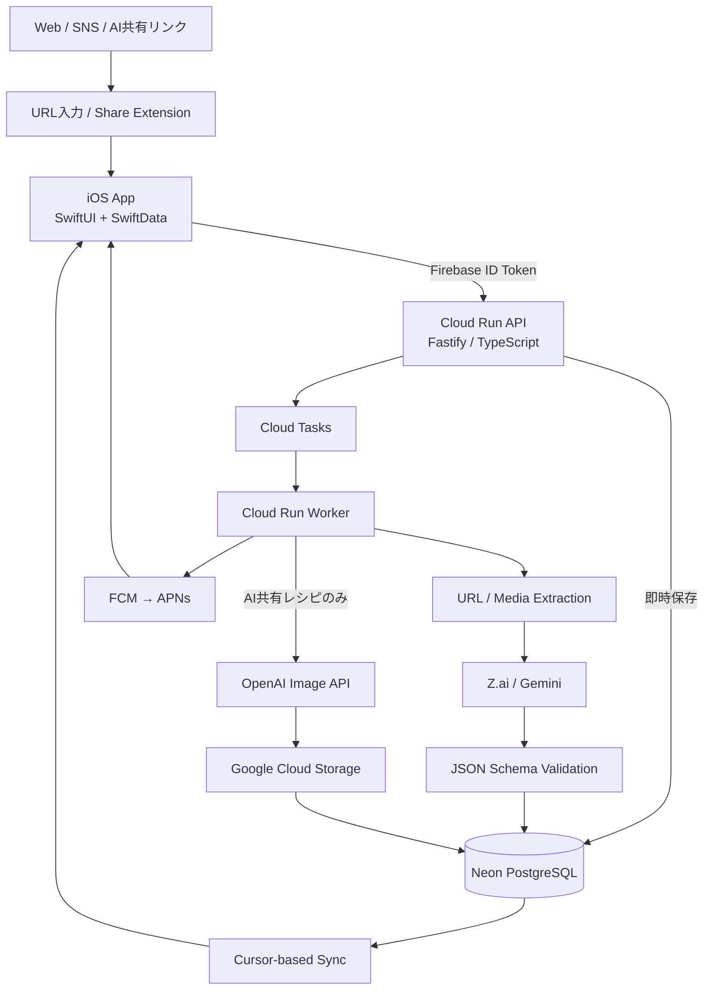

<p align="center">
  
</p>

<h1 align="center">Foodfolio</h1>

<p align="center">
  <strong>ネットやSNSで見つけたレシピを、自分のレシピDBへ。</strong><br />
  URLを保存するだけで、レシピ情報を整理し、あとから検索・閲覧できるiOSアプリです。
</p>

<p align="center">
  <a href="https://github.com/Kay-pht/foodfolio/actions/workflows/quality.yml">
    
  </a>
</p>

<!--
スクリーンショット差し込み位置。
公開READMEでは、横に3枚並ぶiPhone縦長スクリーンショットを推奨します。

欲しいスクリーンショット:
1. レシピ一覧: 実際の料理画像が複数並び、Foodfolioにレシピが集約されていることが一目で分かる画面
2. レシピ詳細: 料理画像・材料・分量・手順が1画面内で確認でき、元サイトを開かなくても使えることが分かる画面
3. 検索: 検索語に加えてジャンル/タグで絞り込んでいる状態が分かる画面

任意で4枚目を追加する場合:
4. Share Extension: Safari / YouTube / SNS等の共有シートからFoodfolioへ追加し、完了状態が表示されている画面

画像は docs/assets/screenshots/ に配置し、端末枠や余白のトーンを揃えると見やすくなります。
-->

## Foodfolioとは

Foodfolioは、YouTube・Instagram・TikTok・レシピサイトなど、複数のサービスに散らばるレシピを1か所へ集約するためのiOSアプリです。

URLを貼り付けるか共有シートからFoodfolioへ送ると、レシピ自体はすぐに保存され、その後バックグラウンドで内容を解析します。取得できた情報は、料理名・材料・分量・人数・調理時間・ジャンル・調理手順などの共通形式へ整理されます。

単なるブックマークではなく、保存後のレシピをFoodfolio内で読み、探し、整理して使えることを重視しています。

### 対応する主なソース

`YouTube` · `Instagram` · `TikTok` · `クラシル` · `クックパッド` · `その他Webサイト` · `ChatGPT公開共有` · `Gemini公開共有`

## 主な機能

| 機能 | 内容 |
| --- | --- |
| URL / 共有シートから保存 | アプリへのURL貼り付けに加え、iOS Share ExtensionからレシピURLを直接追加できます。 |
| バックグラウンドAI解析 | 保存をAI処理完了まで待たせず、非同期で料理名・材料・分量・人数・調理時間・ジャンル・手順を構造化します。 |
| ChatGPT / Gemini共有レシピ | 公開共有会話からレシピ部分を取り込み、通常のレシピと同じ形式で保存できます。条件を満たす場合は完成料理のサムネイルも生成します。 |
| レシピ詳細 | 保存した材料・分量・手順をFoodfolio内で確認できます。基準人数を取得できたレシピは、表示人数に応じて計算可能な分量を比例表示します。 |
| 検索・絞り込み | 料理名・材料のテキスト検索と、ジャンル・ユーザータグによる絞り込みに対応しています。 |
| オフライン閲覧・検索 | 同期済みレシピはSwiftDataへ保持し、一覧・詳細・検索をオフラインでも利用できます。 |
| 編集・タグ整理 | 料理名・材料・分量・ジャンルの編集と、自由入力タグの作成・付与・解除に対応しています。 |
| 解析完了通知 | バックグラウンド解析の完了・失敗をPush通知で受け取れます。 |

## 使い方

```text
SNS / Web / AI共有会話でレシピを見つける
                ↓
URLを貼り付ける / 共有シートからFoodfolioへ送る
                ↓
レシピを即時保存
                ↓
バックグラウンドで取得・AI解析
                ↓
Foodfolio内の共通形式へ整理
                ↓
検索・タグ・詳細画面から再利用
```

## Architecture



BackendはAPIとWorkerを同じNode.js / TypeScriptコードベースで管理しつつ、Cloud Runでは別サービスとして実行します。URL保存とAI解析を分離し、ユーザー操作のレスポンス時間と外部AI処理の失敗を切り離しています。

## Engineering highlights

### 1. 保存を待たせない非同期解析

レシピ作成APIはURLの検証・重複確認後にレシピを保存し、解析処理はCloud Tasks経由でWorkerへ渡します。外部ページ取得やAI処理が長引いても、レシピ保存操作そのものをブロックしない構成です。

### 2. ローカルコピーを使ったオフライン体験

Neon PostgreSQLをユーザーデータのSource of Truthとしつつ、iOS側にはSwiftDataのローカルコピーを保持しています。通常同期はBackend発行cursorによる差分同期で、hard deleteは定期的なRecipe ID照合で検出します。

### 3. 外部URLを扱うための安全な取得境界

外部コンテンツ取得は専用の`SafeHttpClient`へ集約し、URL正規化・リダイレクトを含む取得処理をアプリケーションロジックから分離しています。外部URLを入力として扱う前提で、SSRF対策を含む境界を設けています。

### 4. Workerの並行実行と所有権を明示

解析中のRecipeには`processingRunId`とlease期限を持たせ、古いWorkerが後から結果を書き戻す競合を防ぐ設計です。AI共有レシピの生成画像についても、Workerが所有権を失った場合に自分が生成したオブジェクトだけを補償削除します。

### 5. AIへ送るデータを機能単位で最小化

レシピ解析ではFoodfolioのUser ID・メールアドレス・認証Token・端末TokenをAI Providerへ渡さない方針です。AI共有レシピの画像生成では、共有会話全文ではなく、抽出後のタイトル・材料・手順だけを使用します。詳細は[AI解析におけるデータ送信方針](docs/ai-data-handling.md)に記録しています。

### 6. CIで設計・仕様・テストまで検証

GitHub ActionsのQuality workflowでは、変更範囲に応じてSpecification as Code、アーキテクチャ境界、ドキュメント整合性、format / lint、Prisma、build、unit / integration / E2E、iOS lintなどを検証します。BackendにはVitestとTestcontainers、iOSにはunit / integration / UI test targetを用意しています。

## Tech stack

| Layer | Technology |
| --- | --- |
| iOS | Swift 6, SwiftUI, SwiftData, iOS 26+, Firebase Auth, Firebase Messaging, Google Sign-In |
| Backend | Node.js 24, TypeScript 5.9, Fastify 5 |
| Data | PostgreSQL (Neon), Prisma 7, Google Cloud Storage |
| Async / Cloud | Cloud Run, Cloud Tasks, FCM / APNs, Terraform, Docker |
| AI / Extraction | Z.ai, Google Gemini, OpenAI Image API, Cheerio, Ajv |
| Quality | Vitest, Testcontainers, ESLint, Prettier, swift format, GitHub Actions |

## Repository structure

```text
foodfolio/
├── ios/
│   ├── Foodfolio/                 # iOS app
│   ├── FoodfolioShareExtension/   # Share Extension
│   ├── FoodfolioTests/
│   ├── FoodfolioIntegrationTests/
│   └── FoodfolioUITests/
├── src/
│   ├── api/                       # HTTP API
│   ├── application/               # use cases
│   ├── domain/                    # domain model / rules
│   ├── infrastructure/            # DB / AI / URL / queue / notification adapters
│   └── entrypoints/               # API / Worker entrypoints
├── prisma/                        # DB schema / migrations
├── schemas/                       # AI extraction JSON Schema
├── infra/terraform/               # cloud infrastructure
├── tests/                         # backend unit / integration / E2E
├── specs/                         # Specification as Code
└── docs/                          # requirements / design / operations
```

## Local development

BackendはCloud Run / Cloud Tasksへデプロイせず、API・Worker・PostgreSQLをローカルでまとめて起動できます。

```bash
npm ci
test -f .env || cp .env.example .env
test -f .env.local || cp .env.local.example .env.local
npm run dev:local
```

iOS SimulatorではXcodeの`Foodfolio Local` schemeを使用すると、ローカルAPI (`http://127.0.0.1:8080`) へ接続できます。必要なAPIキー、Firebase認証、ローカルqueueの挙動などは[ローカル開発手順](docs/local-development.md)を参照してください。

## Documentation

仕様・設計・運用上の判断は、実装と同じリポジトリ内で管理しています。

- [ドキュメント索引](docs/README.md)
- [要件定義](docs/requirements-specification.md)
- [基本設計](docs/basic-design.md)
- [UI / UX設計](docs/ui-ux-design.md)
- [技術選定](docs/technology-selection.md)
- [実装設計](docs/implementation-design.md)
- [AIデータ取扱い](docs/ai-data-handling.md)
- [AI共有レシピの生成サムネイル設計](docs/ai-shared-thumbnail-generation.md)
- [ローカル開発](docs/local-development.md)
